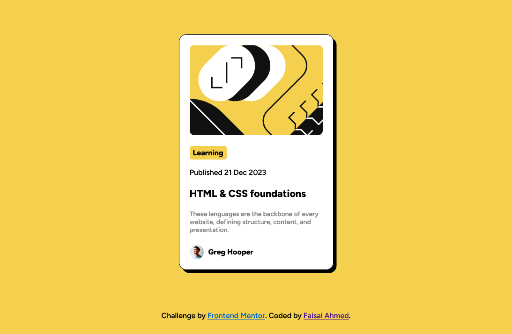
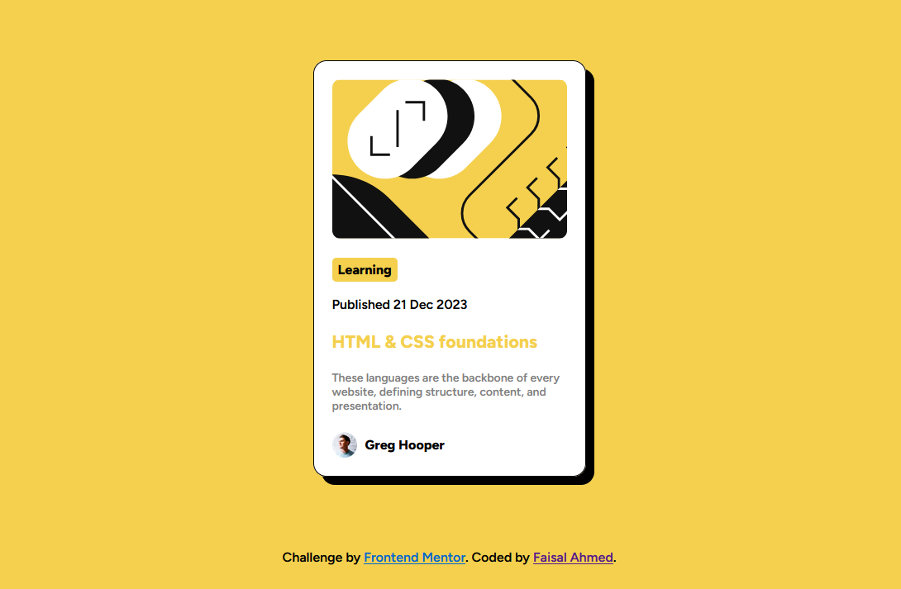

# Frontend Mentor - Blog preview card solution

This is a solution to the [Blog preview card challenge on Frontend Mentor](https://www.frontendmentor.io/challenges/blog-preview-card-ckPaj01IcS). Frontend Mentor challenges help you improve your coding skills by building realistic projects.

## Table of contents

- [Frontend Mentor - Blog preview card solution](#frontend-mentor---blog-preview-card-solution)
  - [Table of contents](#table-of-contents)
  - [Overview](#overview)
    - [The challenge](#the-challenge)
    - [Screenshot](#screenshot)
    - [Links](#links)
  - [My process](#my-process)
    - [Built with](#built-with)
    - [What I learned](#what-i-learned)
  - [Author](#author)

## Overview

### The challenge

Users should be able to:

- See hover and focus states for all interactive elements on the page

### Screenshot

Active

### Links

- Solution URL: [https://github.com/faisalahmed11/blog-preview-card-main](https://github.com/faisalahmed11/blog-preview-card-main)
- Live Site URL: [(https://faisalahmed11.github.io/blog-preview-card-main/)](https://faisalahmed11.github.io/blog-preview-card-main/)

## My process

### Built with

- Semantic HTML5 markup
- CSS custom properties
- Flexbox
- CSS Grid
- Mobile-first workflow

### What I learned

In this project, I have polished my html and Css Skills

## Author

- LinkedIn - [https://www.linkedin.com/in/faisalahmed11/](https://www.linkedin.com/in/faisalahmed11/)
- Frontend Mentor - [https://www.frontendmentor.io/profile/faisalahmed11](https://www.frontendmentor.io/profile/faisalahmed11)
- Twitter - [https://twitter.com/Faisal_Ahmed_01](https://twitter.com/Faisal_Ahmed_01)
